 

<table align="center">
  <tr>
    <td width="440" valign="middle"></td>
    <td width="420" valign="middle"></td>
  </tr>
</table>

<h3>evan@github ~ $ cat now.txt</h3>

Building AI agents and polished web experiences · SUTD '30

